+++
date = '2026-08-24T12:00:00-07:00'
title = "I rebuilt otel-desktop-viewer on top of DuckDB"
description = "and all I got was locally searchable traces, metrics, and logs."
summary = "and all I got was locally searchable traces, metrics, and logs."
tags = ['OpenTelemetry', 'otel','otel-desktop-viewer', 'duckdb', 'svelte', 'traces', 'logs', 'metrics']
author = 'Mila Ardath'
[cover]
  image = "hero.png"
  # The image is a page-bundle resource; without this the og:image tag
  # resolves it against the site root and 404s.
  relative = true
  alt = "A trace waterfall in otel-desktop-viewer: thirty spans across six services, each service in its own colour, with the span detail pane open on the right."
  hiddenInSingle = true
  hiddenInList = false
+++

The project crossed 1,000 stars on GitHub yesterday, and [v0.5.0](https://github.com/CtrlSpice/otel-desktop-viewer/releases/tag/v0.5.0) just went out the door, full of bug fixes!
Together, that felt like a good excuse for a proper reintroduction, three years and one DuckDB rewrite after I shipped the first version.

## What's an otel-desktop-viewer anyway?

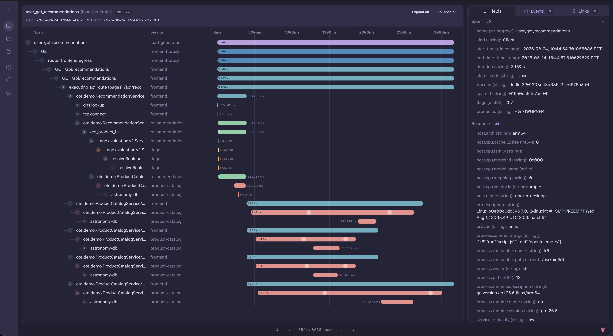

`otel-desktop-viewer` is a single binary that lets you search and query your OpenTelemetry traces, metrics, and logs locally in your browser.
Inside, a lightweight Collector receives your telemetry, an embedded [DuckDB](https://duckdb.org/) stores and queries the data, and a Svelte UI puts it on screen.
It [installs in a single step](https://github.com/CtrlSpice/otel-desktop-viewer#getting-started), and there's no backend to run, no compose file, and no storage to configure.

Fundamentally, a local debugger has different needs than a tool built for production.
A production tool's job is to help you find relevant telemetry in a big ol' pile of data.
Some of that gets in the way when working locally.

Think about being dropped into a query builder first thing.
What do I even type in?
We're running locally, and we might only have four traces total.
We shouldn't need to search for them at all.

So `otel-desktop-viewer` shows you everything as it arrives, the way `tail -f` does for a log file.
It's all right there, and you can search it once there's enough data to be worth narrowing down.

## Why DuckDB

Storage has the same problem.
OTLP data needs somewhere to go, and every backend you could send it to wants its own deployment.
DuckDB is an embeddable columnar database, so it gets compiled into the binary and telemetry goes straight into it.

Here's what that bought, and how:

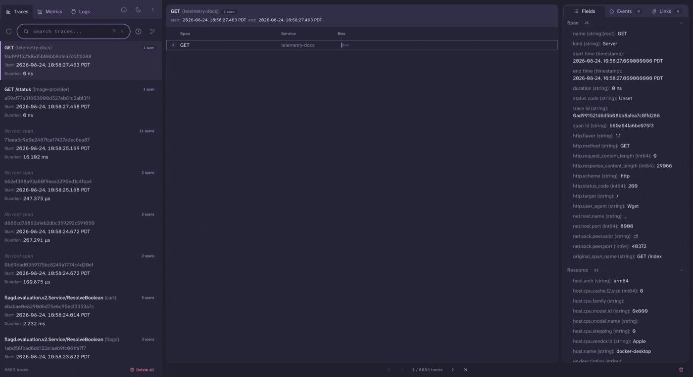

- **When you do need to search, you can query your telemetry meaningfully instead of just scrolling through it.**
  The same syntax works on traces, metrics, and logs, and you can find a span by an event inside it or by the span it links to.
  Some examples of things you can type into the search box:

  ```
  event.name = exception
  service.name = cart AND statusCode = Error
  duration > 1000000000
  name CONTAINS checkout
  ```

- **A trace with thousands of spans opens fast and stays smooth while you scroll.**
  Span trees are built by the database: a recursive CTE walks the parent-child links and hands back rows already in the order the waterfall draws them, so nothing in the browser has to assemble a tree.
  Let DuckDB handle it.

- **Drawing a chart doesn't stall the UI.**
  Quantiles, histogram merges, and cumulative and delta handling all happen in the query, and so does getting a few thousand datapoints down to chart size.
  Y'all, metrics maths with DuckDB is so cool, and this is me teasing the next blog post with the subtlety of a possum.

- **The store stays small.**
  Attributes live in a content-addressed dictionary shared across spans, logs, metrics, and everything else, so each distinct key/value pair is stored once no matter how many things carry it.
  On my test capture that turns 723,692 attribute rows into 267 dictionary entries.

- **Jump between logs, metrics, and traces using trace context. They're all connected.**
  All three signals live in the same store, so following a trace ID across them is a lookup.

- **Your data can be a file.**
  By default nothing is written to disk: you look at your data, close the tab, and it's gone.
  Pass `--db` and you get a DuckDB file you can come back to, send to a colleague, or hand to an agent.

## Traces

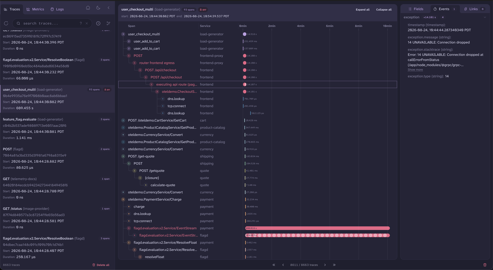

Traces open as a waterfall, with all the usual waterfall things.
Collapse subtrees, or move through them from the keyboard.
The list is on the left, span details on the right, and this checkout trace runs 74 spans across 12 services.

Errors are designed to stand out.
Span bars get a colour per service, and anything carrying an `Error` status or an exception event drops out of that rotation and takes the error colour instead.
Red always means the same thing, no matter how many services are in play.



Events and links are both clickable.
Event dots sit on the span bar, and clicking one puts the span and the event in the URL, so you can bookmark the exact thing you were looking at and come back to it.
Links take you to the linked span, in whatever trace it lives in.

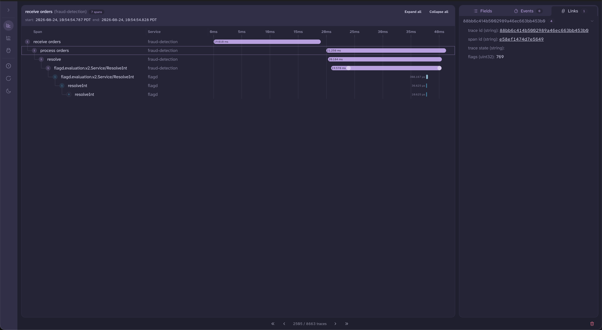

## Metrics

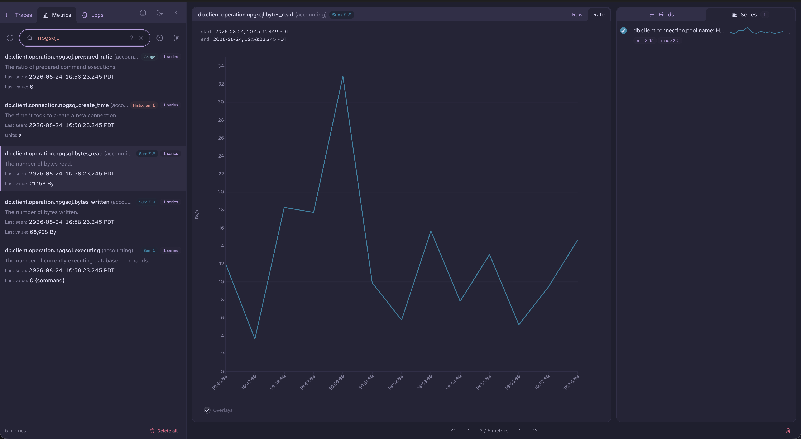

All five OTel instrument shapes are supported: gauges, counters, up-down counters, histograms, and exponential histograms, though the demo app in these screenshots only emits the first four.
The chart you get depends on which one you picked, and you're only offered the aggregations that mean something for it.
I learned a lot of metrics maths so you don't have to.

Histograms get three views of the same data: a heatmap, a quantile view you can flip between p50, p95, and p99, and the bucket distribution itself.
Or ignore all that and lookit the pretty graphs!

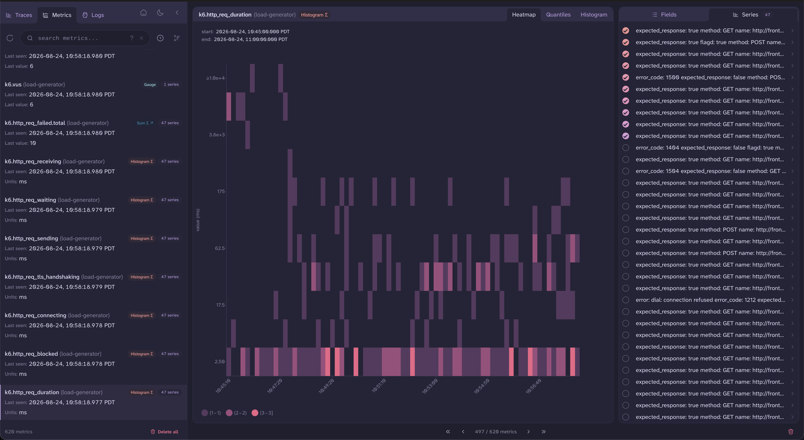

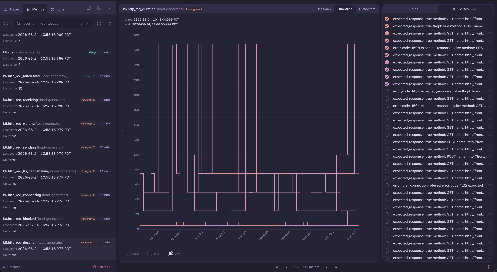

Anything with more than one series overlays by default, with a legend, per-series sparklines, and min/max/average overlays you can switch on.
I have spent way too long toggling those overlays on and off for funsies, because they're pretty and my squirrel brain has needs.

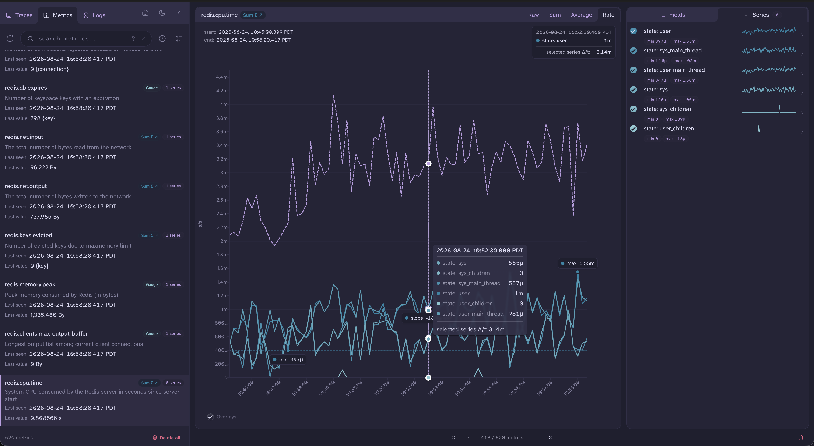

Some datapoints arrive carrying exemplars: pointers back to the spans that produced the number.
Those say so, and clicking one takes you straight there.

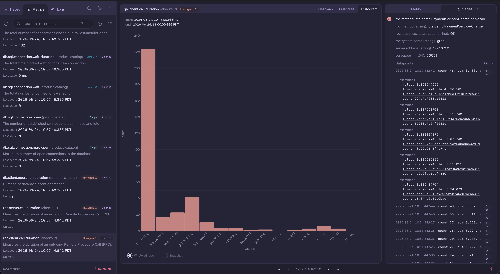

## Logs

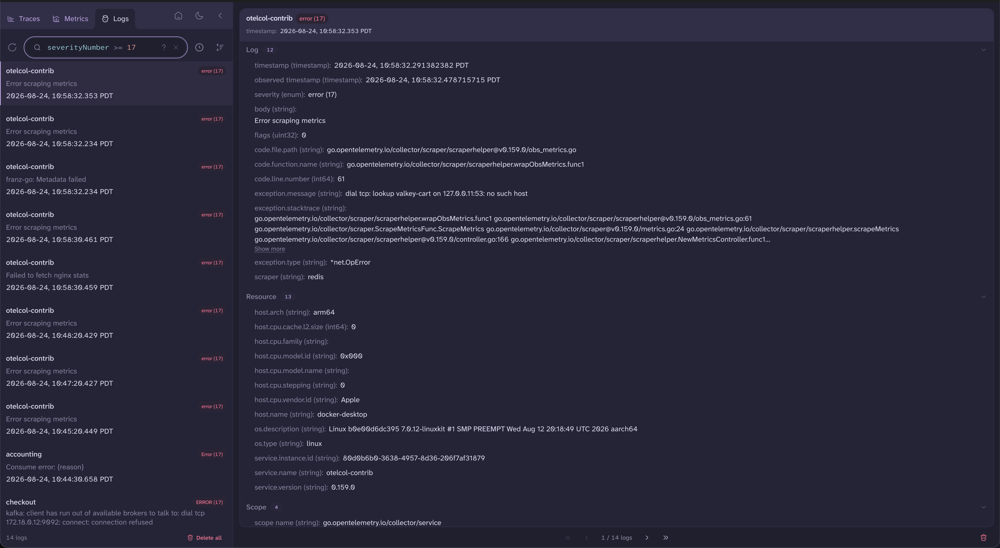

Logs are searchable on every field, including severity as a number, so `severityNumber >= 17` gets you ERROR and above without guessing whether the emitter wrote `Error`, `ERROR`, or `err`.

A record that arrived with trace context shows its trace and span IDs, and clicking either takes you to that span in its trace.
No copying an ID out of one pane and pasting it into another.

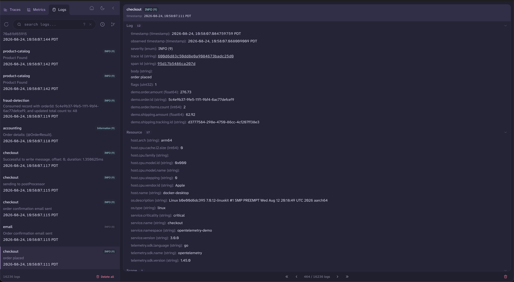

## Coming up

**Sharing:**
You can already move the store around, since it's a file.
I still want to build a way to export a slice of what you're looking at, and a way to load someone else's back in.
That waits on the schema settling down, because asking people to trade files whose layout changes every month would be rude.

**Agents:**
The world of observability looks different from when I started this project in 2023.
Developer tools now have to serve agents as well as people, and an agent could drive the same query surface the UI uses.
Instead of handing you a summary you have to take on faith, it can show you exactly where to look in your own data, so you can see the problem for yourself.

More on that soon.

## Try it out

Point an OTLP exporter at it and your telemetry shows up in the browser.
[The README](https://github.com/CtrlSpice/otel-desktop-viewer#getting-started) has install instructions for Homebrew, Docker, `go install`, and prebuilt binaries.
Issues and PRs are welcome, as always.
